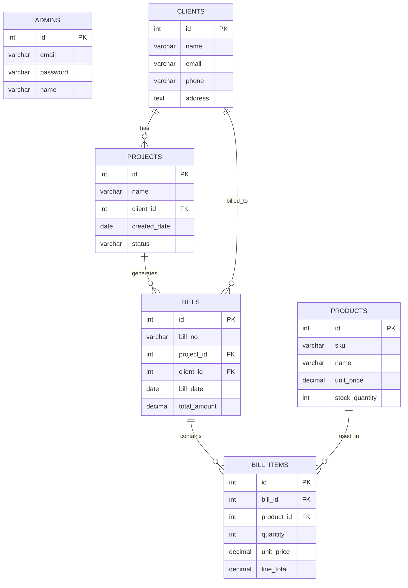
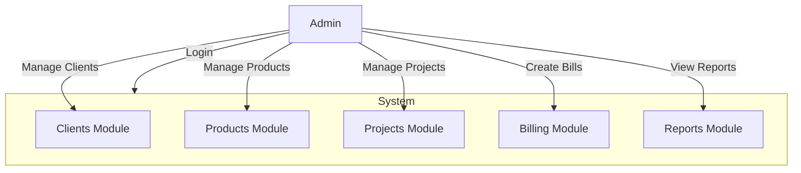
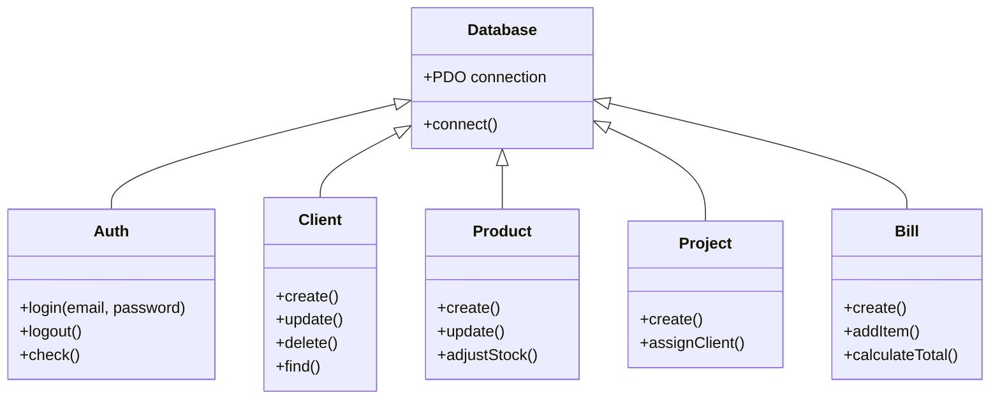

# Project Documentation - Technosky Solar System (SolarTech Pro)

This document provides project-level documentation for Technosky Solar System the  admin panel and billing system.

## 1) Introduction

Technosky Solar System  is a lightweight PHP-based admin panel designed to manage clients, projects, products, and billing for a solar equipment company. The application provides an admin login, client and product management, project tracking, and bill generation with line items.

Key modules:
- Authentication (admin)
- Client management
- Product inventory management
- Projects management
- Billing and bill items
- Reports and settings

## 2) Objectives of the project

- Provide a simple admin interface to manage solar projects and clients.
- Maintain product inventory and pricing.
- Generate bills for projects with itemized line items.
- Store and track project and client relationships.
- Allow administrators to view reports and system settings.

## 3) Purpose of project

The project aims to automate administrative tasks for a solar equipment business: storing client data, tracking projects, managing inventory, and producing accurate invoices to speed up operations and reduce manual errors.

## 4) Software Design

Architecture:
- Monolithic PHP application using plain PHP files and a PDO-based database connection.
- Server-side rendered HTML with some client-side JS for small UX enhancements (form validation, password toggle).
- Database: PostgreSQL/MySQL-compatible schema provided in `sql/schema.sql` (the schema file uses MySQL-style CREATE statements; `includes/db.php` shows a PDO PostgreSQL connection example).

Main directories:
- `public/` — public-facing PHP pages (login, dashboard, clients, products, bills, etc.).
- `includes/` — shared code (database connection `db.php`, authentication `auth.php`, header/footer includes).
- `css/` — styles (`style.css`).
- `sql/` — database schemas (`schema.sql`, `schema1.sql`).

Data flow (brief):
- Admin authenticates via `public/login.php` which uses the login function (in `includes/auth.php`) and the PDO connection (`includes/db.php`).
- CRUD operations for clients, products, and projects are performed by `public/*.php` pages and write/read to the `solar_company` database.
- Bills are created and stored across `bills` and `bill_items` tables with foreign keys to `projects`, `clients`, and `products`.

Contract (inputs/outputs/errors):
- Inputs: HTTP form data (POST/GET) from admin UI.
- Outputs: HTML pages, redirect responses, and database updates.
- Errors: Database connection errors (exceptions from PDO), validation errors on forms, and permission checks for unauthorized access.

Edge cases considered:
- Missing foreign key (NULL client or project on delete thanks to `ON DELETE SET NULL`).
- Bill item cascade delete when a bill is deleted.
- Duplicate unique fields (e.g., `admins.email`, `products.sku`, `bills.bill_no`) cause DB errors—application should prevent duplicates.

## 5) Visibility Study

Stakeholders:
- Admin users (system administrators, accounting staff)
- Business managers (project tracking)
- Inventory staff (product stock)

Visibility constraints:
- The admin interface should be accessible only after authentication.
- Sensitive data (passwords) must be stored securely (currently the example `schema.sql` inserts plain-text password — this must be fixed to use password hashing like `password_hash()` in PHP).

Security notes:
- Use HTTPS in production.
- Use parameterized queries (PDO prepared statements) for all DB access — `includes/db.php` sets PDO with exceptions and associative fetch mode.
- Replace plain-text passwords with bcrypt (`password_hash`) and verify with `password_verify`.

## 6) System Requirements

Minimum environment to run locally:
- OS: Windows / Linux / macOS with PHP support
- Web server: Apache (XAMPP) or similar
- PHP: 7.4+ (PDO extension enabled)
- Database: MySQL 5.7+/PostgreSQL (adjust `includes/db.php`) — schema provided in `sql/schema.sql` (MySQL style)
- Browser: Modern browser (Chrome, Firefox, Edge)

Recommended (production):
- PHP 8.0+
- Use HTTPS (TLS)
- Properly configured firewall and database authentication
- Use Composer to manage PHP libraries if adding packages

## 7) ER Diagram (Mermaid)

The database tables are: admins, clients, products, projects, bills, bill_items.

Below is a Mermaid ER diagram you can paste into a Mermaid renderer (e.g., VS Code Mermaid preview or live editor).

## 8) Use Case Diagram (Mermaid)

Use the Mermaid flowchart for a simple use-case diagram.

## 9) Class Diagram (Mermaid)

Below is a conceptual class diagram (not tied to an OOP implementation, but useful if you refactor to OOP PHP).

## 10) Screenshot of code

I can't take screenshots from here, but you can add code screenshots to `docs/screenshots/`.

Suggested steps to capture code screenshots:
1. Open the file you want to capture in VS Code (for example, `includes/db.php`, `sql/schema.sql`, `public/login.php`).
2. Use the native OS screenshot tool or the VS Code extension "Polacode" / "CodeSnap" to capture a neat image.
3. Save images in `docs/screenshots/` (create this directory) and name them like `db_connection.png`, `schema.png`, `login_page.png`.

Add the screenshots to this README by linking them:

## 11) Advantages

- Simple, easy-to-extend PHP codebase.
- Uses PDO which supports multiple DB engines and prepared statements.
- Clear separation of concerns via `includes/` and `public/` directories.
- Database schema includes foreign keys and cascade rules to maintain referential integrity.

## 12) Future Enhancements (Intonement)

Recommended improvements:
- Use password hashing for admin passwords (PHP's `password_hash` + `password_verify`).
- Add role-based access control (RBAC) for different admin roles.
- Implement CSRF protection and input sanitization across forms.
- Move to an MVC framework (Laravel, Symfony) for maintainability.
- Add automated tests (PHPUnit) and CI pipeline for deployments.
- Add API endpoints (REST) and a React/Vue frontend for a modern SPA.
- Add activity logs and audit trails for billing and admin actions.

## 13) Conclusion

Technosky Solar System provides a working starting point for managing clients, products, projects, and billing. With modest hardening (password hashing, input validation, HTTPS), and optional refactors into an MVC framework, it can be turned into a production-ready admin system for solar businesses.

---

If you'd like, I can:
- Generate the `docs/screenshots/` directory and add placeholder images.
- Produce PNG/SVG renderings of the Mermaid diagrams and commit them.
- Convert the documentation into a nicely formatted `README.md` and add a `docs/` site scaffold.

Tell me which follow-up you'd like and I'll continue.
